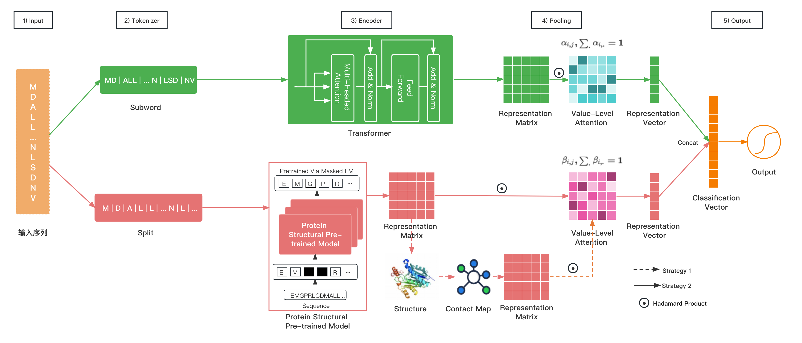
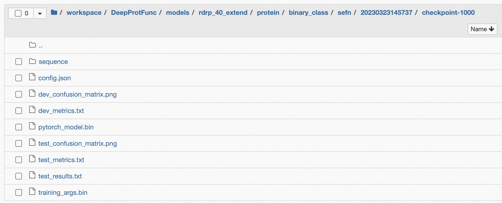
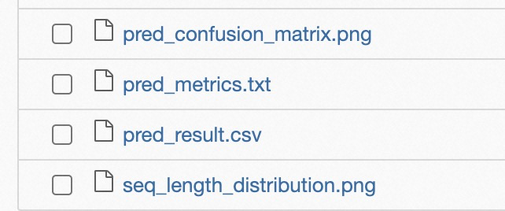

# LucaProt   
**LucaProt(DeepProtFunc)** is an open source project developed by **Alibaba** and licensed under the **Apache License (Version 2.0)**.

This product contains various third-party components under other open source licenses.     
See the **NOTICE** file for more information.

**Notice:**     
**This project provides the Python dependency environment installation file, installation commands, and the running command of the trained LucaProt model for inference or prediction, which can be found in this repository. These models are compatible with Linux, Mac OS, and Windows systems, supporting both CPU and GPU configurations for inference tasks.**


## TimeLine   
* 2024/09/24: A free CPU version of `LucaProt Server` is available online (http://lucaprot.org).
* 2024/09/01: Optimize inference and prediction code to run on GPU with small graphics memory, such as A10.    

## LucaProt Server        
LucaProt Server(CPU) is available at: https://lucaprot.org.     
Limit inference to a maximum of 100 sequences at a time.     
The GPU version will come soon.    
<center>


LucaProt Server
</center>

# Introduction    
**LucaProt**: A novel deep learning framework that incorporates protein amino acid sequence and structural information to predict protein function.

# 1. Model    

## 1) Model Introduction     

We developed a new deep learning model, namely, Deep Sequential and Structural Information Fusion Network for Proteins Function Prediction (DeepProtFunc/LucaProt), which takes into account protein sequence and structural information to facilitate the accurate annotation of protein function.

Here, we applied LucaProt to identify viral RdRP.      

## 2) Model Architecture    

We treat protein function prediction as a classification problem. For example, viral RdRP identification is a binary-class classification task, and protein general function annotation is a multi-label classification task. The model includes five modules: Input, Tokenizer, Encoder, Pooling, and Output. Its architecture is shown in Figure 1.


<center>


Figure 1 The Architecture of LucaProt
</center>

## 3) Model Input/Output     

Use the amino acid letter sequence as the input of our model. The model outputs the function label of the input protein, which is a single tag (binary-class classification or multi-class classification) or a set of tags (multi-label classification).


# 2. Dependence       
System: Ubuntu 20.04.5 LTS       
Python: 3.9.13          
Download anaconda: <a href="https://repo.anaconda.com/archive/Anaconda3-2022.10-Linux-x86_64.sh" title="anaconda"> anaconda </a>       
Cuda: <a href="https://developer.nvidia.com/cuda-11-7-0-download-archive" title="cuda11.7 (torch==1.13.1)"> cuda11.7 (torch==1.13.1)</a>
```shell
# Select 'YES' during installation for initializing the conda environment  
sh Anaconda3-2022.10-Linux-x86_64.sh  
# Source the environment
source ~/.bashrc  
# Verification
conda  
# Install env and python 3.9.13   
conda create -n lucaprot python=3.9.13    
# activate env
conda activate lucaprot  
# Install git      
sudo apt-get update         
sudo apt install git-all

# Enter the project   
cd LucaProt     

# Install
pip install -r requirements.txt -i https://pypi.tuna.tsinghua.edu.cn/simple        
```

# 3. Inference          
You can simply use this project to infer or predict for unknown sequences.    

## 1) Prediction from one sequence        

```
cd LucaProt/src/prediction/ 
sh run_predict_one_sample.sh
```

**Note:** the embedding matrix of the sample is real-time predictive.

**Or:**

```
cd LucaProt/src/

# using GPU(cuda=0)    
export CUDA_VISIBLE_DEVICES="0,1,2,3"
python predict_one_sample.py \
    --protein_id protein_1 \
    --sequence MTTSTAFTGKTLMITGGTGSFGNTVLKHFVHTDLAEIRIFSRDEKKQDDMRHRLQEKSPELADKVRFFIGDVRNLQSVRDAMHGVDYIFHAAALKQVPSCEFFPMEAVRTNVLGTDNVLHAAIDEGVDRVVCLSTDKAAYPINAMGKSKAMMESIIYANARNGAGRTTICCTRYGNVMCSRGSVIPLFIDRIRKGEPLTVTDPNMTRFLMNLDEAVDLVQFAFEHANPGDLFIQKAPASTIGDLAEAVQEVFGRVGTQVIGTRHGEKLYETLMTCEERLRAEDMGDYFRVACDSRDLNYDKFVVNGEVTTMADEAYTSHNTSRLDVAGTVEKIKTAEYVQLALEGREYEAVQ	\
    --emb_dir ./emb/ \
    --truncation_seq_length 4096 \
    --dataset_name rdrp_40_extend \
    --dataset_type protein \
    --task_type binary_class \
    --model_type sefn \
    --time_str 20230201140320 \
    --step 100000 \
    --threshold 0.5 \
    --gpu_id 0
  
# using CPU(gpu_id=-1)    
python predict_one_sample.py \
    --protein_id protein_1 \
    --sequence MTTSTAFTGKTLMITGGTGSFGNTVLKHFVHTDLAEIRIFSRDEKKQDDMRHRLQEKSPELADKVRFFIGDVRNLQSVRDAMHGVDYIFHAAALKQVPSCEFFPMEAVRTNVLGTDNVLHAAIDEGVDRVVCLSTDKAAYPINAMGKSKAMMESIIYANARNGAGRTTICCTRYGNVMCSRGSVIPLFIDRIRKGEPLTVTDPNMTRFLMNLDEAVDLVQFAFEHANPGDLFIQKAPASTIGDLAEAVQEVFGRVGTQVIGTRHGEKLYETLMTCEERLRAEDMGDYFRVACDSRDLNYDKFVVNGEVTTMADEAYTSHNTSRLDVAGTVEKIKTAEYVQLALEGREYEAVQ	\
    --emb_dir ./emb/ \
    --truncation_seq_length 4096 \
    --dataset_name rdrp_40_extend \
    --dataset_type protein \
    --task_type binary_class \
    --model_type sefn \
    --time_str 20230201140320 \
    --step 100000 \
    --threshold 0.5 \
    --gpu_id -1
```


* **--protein_id**    
  str, the protein id.   

* **--sequence**    
  str, the protein sequence.   

* **--truncation_seq_length**    
  int, truncate sequences longer than the given value. Recommended values: 4096, 2048, 1984, 1792, 1534, 1280, 1152, 1024, default: 4096.    

* **--emb_dir(optional)**        
  path, the saved dirpath of the protein predicted embedding matrix or vector during prediction, optional.   

* **--dataset_name**        
  str, the dataset name for building of our trained model(**rdrp_40_extend**).   

* **--dataset_type**       
  str, the dataset type for building of our trained model(**protein**).   

* **--task_type**      
  str, the task type for building of our trained model(**binary_class**).   

* **--model_type**      
  str, the model name for building of our trained model(**sefn**).     

* **--time_str**    
  str, the running time string(yyyymmddHimiss) for building of our trained model(**20230201140320**).    

* **--step**      
  int, the training global step of model finalization(**100000**).  

* **--threshold**    
  float, sigmoid threshold for binary-class or multi-label classification, None for multi-class classification, default: **0.5**.   

* **--gpu_id**:
  int, the gpu id to use(**-1 for cpu**).         

* **--torch_hub_dir(optional)**:    
  str, the torch hub dir path for saving pretrained model(default:~/.cache/torch/hub)


## 2) Prediction from many sequences        
the samples are in *.fasta, sample by sample prediction.     

* **--fasta_file**    
  str, the samples fasta file.     

* **--save_file**    
  str, file path, save the predicted results into the file.    

* **--print_per_number**   
  int, print progress information for every number of samples completed, default: **100**.       


```shell
cd LucaProt/src/prediction/   
sh run_predict_many_samples.sh
```

**Or:**

```shell
cd LucaProt/src/

# using GPU(cuda=0)   
export CUDA_VISIBLE_DEVICES="0,1,2,3"  
python predict_many_samples.py \
	--fasta_file ../data/rdrp/test/test.fasta  \
	--save_file ../result/rdrp/test/test_result.csv  \
	--emb_dir ../emb/   \
	--truncation_seq_length 4096  \
	--dataset_name rdrp_40_extend  \
	--dataset_type protein     \
	--task_type binary_class     \
	--model_type sefn     \
	--time_str 20230201140320   \
	--step 100000  \
	--threshold 0.5 \
	--print_per_number 10 \
	--gpu_id 0
	

# using CPU(gpu_id=-1)               
python predict_many_samples.py \
	--fasta_file ../data/rdrp/test/test.fasta  \
	--save_file ../result/rdrp/test/test_result.csv  \
	--emb_dir ../emb/   \
	--truncation_seq_length 4096  \
	--dataset_name rdrp_40_extend  \
	--dataset_type protein     \
	--task_type binary_class     \
	--model_type sefn     \
	--time_str 20230201140320   \
	--step 100000  \
	--threshold 0.5 \
	--print_per_number 10 \
	--gpu_id -1
```


## 3) Prediction from the file(embedding file exists in advance)       

The test data (small and real) is in [demo.csv](./data/rdrp/demo/demo.csv), where the 7th column of each line is the filename of the structural embedding information prepared in advance.   
And the structural embedding files store in [embs](./data/rdrp/demo/embs).

The test data includes 50 viral-RdRPs and 50 non-viral RdRPs.

```
cd LucaProt/src/prediction/   
sh run_predict_from_file.sh
```

**Or:**

```
cd LucaProt/src/

# using GPU(cuda=0)   
export CUDA_VISIBLE_DEVICES="0,1,2,3"
python predict.py \
    --data_path ../data/rdrp/demo/demo.csv \
    --emb_dir ../data/rdrp/demo/embs/esm2_t36_3B_UR50D \
    --dataset_name rdrp_40_extend \
    --dataset_type protein \
    --task_type binary_class \
    --model_type sefn \
    --time_str 20230201140320 \
    --step 100000 \
    --evaluate \
    --threshold 0.5 \
    --batch_size 16 \
    --print_per_batch 100 \
    --gpu_id 0 
    
# using CPU(gpu_id=-1)          
python predict.py \
    --data_path ../data/rdrp/demo/demo.csv \
    --emb_dir ../data/rdrp/demo/embs/esm2_t36_3B_UR50D \
    --dataset_name rdrp_40_extend \
    --dataset_type protein \
    --task_type binary_class \
    --model_type sefn \
    --time_str 20230201140320 \
    --step 100000 \
    --evaluate \
    --threshold 0.5 \
    --batch_size 16 \
    --print_per_batch 100 \
    --gpu_id -1
```

* **--data_path**    
  path, the file path of prediction data, including 9 columns mentioned above. The value of Column Label can be null.

* **--emb_dir**    
  path, the saved dirpath of all sample's structural embedding information prepared in advance.

* **--dataset_name**       
  str, the dataset name for building of our trained model(**rdrp_40_extend**).

* **--dataset_type**       
  str, the dataset type for building of our trained model(**protein**).

* **--task_type**      
  str, the task name for building of our trained model(**binary_class**).

* **--model_type**      
  str, the model name for building of our trained model(**sefn**).

* **--time_str**    
  str, the running time string(yyyymmddHimiss) for building of our trained model(**20230201140320**).

* **--step**      
  int, the training global step of model finalization(**100000**).

* **--threshold**   
  float, sigmoid threshold for binary-class or multi-label classification, None for multi-class classification, default: 0.5.

* **--evaluate(optional)**     
  store_true, whether to evaluate the predicted results.

* **--ground_truth_col_index(optional)**    
  int, the ground truth col index of the ${data_path}, default: None.

* **--batch size**     
  int, batch size per GPU/CPU for evaluation, default: 16.

* **--print_per_batch**      
  int,  how many batches are completed every time for printing progress information, default: 1000.

* **--gpu_id**:
  int, the gpu id to use(**-1 for cpu**).     

* **--torch_hub_dir(optional)**:    
  str, he torch hub dir path for saving pretrained model(default:~/.cache/torch/hub)  

**Note:** the embedding matrices of all the proteins in this file need to prepare in advance(**$emb_dir**).

# 4. 11 independent validation datasets   
11 verification datasets unrelated to the model building dataset, include 7 exists viral-RdRP datasets and 4 exists non viral-RdRP datasets.   
Run the prediction python script  `https://github.com/alibaba/LucaProt/src/predict_many_samples.py`    
The performance on these 11 independent verification datasets of LucaProt.      
[LucaProt-Performance-On-11-Independent-Datasets.xlsx](http://47.93.21.181/LucaProt/LucaProt-Performance-On-11-Independent-Datasets.xlsx)     
or [LucaProt Figshare](https://doi.org/10.6084/m9.figshare.26298802.v13)   

# 5. LucaProt App   
This project is used to predict unlabeled protein sequences and to measure the time spent.   
[LucaProtApp](http://47.93.21.181/Benchmark/LucaProtApp/) or [LucaProt Figshare](https://doi.org/10.6084/m9.figshare.26298802.v13)   

# 6. Inference Time
**LucaProt** is suitably speedy because it only needs to predict the **structural representation matrix** rather than the complete **3D structure** of the protein sequence.

**Benchmark:** For each sequence length range(total 10 groups), selected **50** viral-RdRPS and **50** non-viral RdRPs for each group for inference time cost calculation.    
[inference_time_data_of_github.csv](http://47.93.21.181/Benchmark/LucaProtApp/data/inference_time/inference_time_data_of_github.csv)    
or [LucaProt Figshare](https://doi.org/10.6084/m9.figshare.26298802.v13)

**Note:**  The spend time includes the time of the **structural representation matrix** inference, excludes the time of model loading.

## 1) GPU(Nvidia A100, Cuda: 11.7)  

**Notice**: when the sequence length does not exceed 1024, you can use the 24GB GPU for inference, such as the A10.        

|  Protein Seq Len Range  |  Average Time  |  Maximum Time  |  Minimum Time  |
|:-----------------------:|:--------------:|:--------------:|:--------------:|
|    300 <= Len < 500     |     0.20s      |     0.24s      |     0.16s      |
|    500 <= Len < 800     |     0.30s      |     0.39s      |     0.24s      | 
|   800 <= Len < 1,000    |     0.42s      |     0.46s      |     0.39s      |
|  1,000 <= Len < 1,500   |     0.59s      |     0.74s      |     0.45s      | 
|  1,500 <= Len < 2,000   |     0.87s      |     1.02s      |     0.73s      |   
|  2,000 <= Len < 3,000   |     1.31s      |     1.69s      |     1.01s      |   
|  3,000 <= Len < 5,000   |     2.14s      |     2.78s      |     1.72s      |
|  5,000 <= Len < 8,000   |     3.03s      |     3.45s      |     2.65s      |
|  8,000 <= Len < 10,000  |     3.77s      |     4.24s      |     3.32s      |
|      10,000 <= Len      |     9.92s      |     17.66s     |     4.30s      | 


## 2) CPU (16 cores, 64G memory of Alibaba Cloud ECS)

|  Protein Seq Len Range  | Average Time | Maximum Time | Minimum Time |
|:-----------------------:|:------------:|:------------:|:------------:|
|    300 <= Len < 500     |    3.97s     |    5.71s     |    2.77s     |
|    500 <= Len < 800     |    5.78s     |    7.50s     |    4.48s     | 
|   800 <= Len < 1,000    |    8.23s     |    9.41s     |    7.41s     |
|  1,000 <= Len < 1,500   |    11.49s    |    16.42s    |    9.22s     | 
|  1,500 <= Len < 2,000   |    17.71s    |    22.36s    |    14.93s    |   
|  2,000 <= Len < 3,000   |    26.97s    |    36.68s    |    20.99s    |   
|  3,000 <= Len < 5,000   |    45.56s    |    58.42s    |    35.82s    |
|  5,000 <= Len < 8,000   |    56.57s    |    58.17s    |    55.55s    |
|  8,000 <= Len < 10,000  |    57.76s    |    58.86s    |    56.66s    |
|      10,000 <= Len      |    66.49s    |    76.80s    |    58.42s    |


## 3) CPU (96 cores, 768G memory of Alibaba Cloud ECS)

|  Protein Seq Len Range  | Average Time | Maximum Time | Minimum Time |
|:-----------------------:|:------------:|:------------:|:------------:|
|    300 <= Len < 500     |    1.89s     |    2.55s     |    1.10s     |
|    500 <= Len < 800     |    2.68s     |    3.44s     |    2.13s     | 
|   800 <= Len < 1,000    |    3.45s     |    4.25s     |    2.65s     |
|  1,000 <= Len < 1,500   |    4.27s     |    5.90s     |    3.54s     | 
|  1,500 <= Len < 2,000   |    5.81s     |    7.44s     |    4.76s     |   
|  2,000 <= Len < 3,000   |    8.14s     |    10.74s    |    6.37s     |   
|  3,000 <= Len < 5,000   |    13.25s    |    17.69s    |    10.06s    |
|  5,000 <= Len < 8,000   |    17.03s    |    18.20s    |    15.98s    |
|  8,000 <= Len < 10,000  |    17.90s    |    18.99s    |    16.92s    |
|      10,000 <= Len      |    25.90s    |    35.02s    |    18.66s    | 


# 7. Dataset for Virus RdRP

## 1) Fasta

* **Viral RdRP(Positive: 5,979)**

  The positive sequence fasta file is in `data/rdrp/all_dataset_positive.fasta.zip`                               
  [all_dataset_positive.fasta.zip](http://47.93.21.181/LucaProt/data/rdrp/all_dataset_positive.fasta.zip)   
  or [LucaProt Figshare](https://doi.org/10.6084/m9.figshare.26298802.v13)     


* **Non-viral RdRP(Negative: 229434)**

  The negative sequence  fasta file is in `dataset/rdrp/all_dataset_negative.fasta.zip`        
  including:

  * other proteins of the virus
  * other protein domains of the virus
  * non-viral proteins

  [all_dataset_negative.fasta.zip](http://47.93.21.181/LucaProt/data/rdrp/all_dataset_negative.fasta.zip)   
  or [LucaProt Figshare](https://doi.org/10.6084/m9.figshare.26298802.v13)     

## 2) Structural embedding(matrix and vector)
All structural embedding files of the dataset for model building are available at: [embs](http://47.93.21.181/LucaProt/dataset_for_model_building/dataset/rdrp_40_extend/protein/binary_class/)         
All structural embedding files of the prediction data for opening are in the process(because of the amount of data).

## 3) PDB (3D Structure)
All 3D-structure PDB files of the model building dataset and predicted data for opening are in the process (because of the amount of data).

## 4) Vocab
* **structure vocab**      
  This vocab file is `struct_vocab/rdrp_40_extend/protein/binary_class/struct_vocab.txt`                        
  [struct_vocab.txt](struct_vocab/rdrp_40_extend/protein/binary_class/struct_vocab.txt)  


* **subword-level vocab**       
  The size of the vocab of sequence we use is 20,000.            
  This vocab file is `vocab/rdrp_40_extend/protein/binary_class/subword_vocab_20000.txt`                  
  [subword_vocab_20000.txt](vocab/rdrp_40_extend/protein/binary_class/subword_vocab_20000.txt)


* **char-level vocab**         
  This vocab file is `vocab/rdrp_40_extend/protein/binary_class/vocab.txt`                      
  [vocab.txt](vocab/rdrp_40_extend/protein/binary_class/vocab.txt)

## 5) Label
Viral RdRP identification is a binary-class classification task, including positive and negative classes, using 0 and 1 to represent a negative and positive sample, respectively.
The label list file is `dataset/rdrp_40_extend/protein/binary_class/label.txt`                        
[label.txt](dataset/rdrp_40_extend/protein/binary_class/label.txt)

## 6) Dataset
We constructed a data set with 235,413 samples for model building, which included 5,979 positive samples of known viral RdRPs (i.e. the well-curated RdRP database described in the previous section of Methods), and 229,434 (to maintain a 1:40 ratio for viral RdRP and non-virus RdRPs) negative samples of confirmed non-virus RdRPs. And the non-virus RdRPs contained proteins from Eukaryota DNA dependent RNA polymerase (Eu DdRP, N=1,184), Eukaryota RNA dependent RNA polymerase (Eu RdRP, N=2,233), Reverse Transcriptase (RT, N=48,490), proteins obtained from DNA viruses (N=1,533), non-RdRP proteins obtained from RNA viruses (N=1,574), and a wide array of cellular proteins from different functional categories (N=174,420). We randomly divided the dataset into training, validation, and testing sets with a ratio of 8.5:1:1, which were used for model fitting, model finalization (based on the best F1-score training iteration), and performance reporting (including accuracy, precision, recall, F1-score, and Area under the ROC Curve (AUC)), respectively.

* **Entire Dataset**     
  This file is `dataset/rdrp/all_dataset_with_pdb_emb.csv.zip`                                         
  [all_dataset_with_pdb_emb.csv.zip](http://47.93.21.181/LucaProt/data/rdrp/all_dataset_with_pdb_emb.csv.zip)       
  or [LucaProt Figshare](https://doi.org/10.6084/m9.figshare.26298802.v13)       


* **Training set**        
  This file copy to `dataset/rdrp_40_extend/protein/binary_class/train_with_pdb_emb.csv`                 
  [train_with_pdb_emb.csv](http://47.93.21.181/LucaProt/dataset_for_model_building/dataset/rdrp_40_extend/protein/binary_class/train_with_pdb_emb.csv)     
  or [LucaProt Figshare](https://doi.org/10.6084/m9.figshare.26298802.v13)    


* **Validation set**         
  This file copy to `dataset/rdrp_40_extend/protein/binary_class/dev_with_pdb_emb.csv`                         
  [dev_with_pdb_emb.csv](http://47.93.21.181/LucaProt/dataset_for_model_building/dataset/rdrp_40_extend/protein/binary_class/dev_with_pdb_emb.csv)    
  or [LucaProt Figshare](https://doi.org/10.6084/m9.figshare.26298802.v13)   


* **Testing set**         
  This file copy to `dataset/rdrp_40_extend/protein/binary_class/test_with_pdb_emb.csv`                          
  [test_with_pdb_emb.csv](http://47.93.21.181/LucaProt/dataset_for_model_building/dataset/rdrp_40_extend/protein/binary_class/test_with_pdb_emb.csv)     
  or [LucaProt Figshare](https://doi.org/10.6084/m9.figshare.26298802.v13)       

One row in all the above files represents one sample. All three files consist of 9 columns, including **prot_id**, **seq**, **seq_len**, **pdb_filename**, **ptm**, **mean_plddt**, **emb_filename**, **label**, and **source**. The details of these columns are as follows:

* **prot_id**        
  the protein id
* **seq**         
  the amino acid(aa) sequence
* **seq_len**        
  the length of the protein sequence.
* **pdb_filename**        
  The PDB filenames of 3D-structure are predicted by the calculation model or obtained by experiments.
* **ptm**   
  the pTM of the predicted 3D-structure.
* **mean_plddt**   
  the mean pLDDT of the predicted 3D-structure.
* **emb_filename**     
  The filename of the embedding matrix or vector of protein structure.      
  **Note:** the embedding matrics of the dataset need to prepare in advance.
* **label**    
  the sample label, 0 or 1 for binary-class classification, [0, 1, ..., N-1] for multi-class classification, a list of [0, 1, ..., N-1] for multi-label classification.
* **source**    
  optional, the sample source (such as RdRP, RT, DdRP, non-virus RdRP, and Other).

**Note:** if using strategy one in structure encoder, the pdb_filename, the ptm, and the mean_plddt can be null.

# 8. Supported Task Types
You can use this project to train models for other tasks, not just the viral RdRP identification tasks.     

* **binary-class classification**    
  The label is 0 or 1 for binary-class classification, such as viral RdRP identification.


* **multi-class classification**      
  The label is 0~N-1 for multi-class classification, such as the species prediction for proteins.


* **multi-label classification**   
  The labels form a list of 0~N-1 for multi-label classification, such as Gene Ontology annotation for proteins.

# 9. Building Your Model(for re-training or training with new datasets)    

## 1) Prediction of protein 3D-structure(Optional)

The script ```structure_from_esm_v1.py``` is in the directory "src/protein_structure", and it use ESMFold (esmfold_v1) to predict 3D-Structure of protein.

### I. Prediction from file

```
cd LucaProt/src/protein_structure/     

export CUDA_VISIBLE_DEVICES=0

python structure_from_esm_v1.py \
    -i data/rdrp/rdrp.fasta \
    -o pdbs/rdrp/ \
    --num-recycles 4 \
    --truncation_seq_length 4096 \
    --chunk-size 64 \
    --cpu-offload \
    --batch_size 1
```

**Parameters:**
* **-i (input filepaths)**
  * fasta filepath
  * csv filepath    
    the first row is the header        
    column 0: protein_id         
    column 1: sequence
  * mutil filepaths    
    comma-concatenation

* **-o (save dirpath)**     
  The dir path of saving the predicted 3D-structure data, each protein is stored in a PDB file, and each PDB file is named as "protein_" + an auto-increment id + ".pdb", such as "protein_1.pdb".    
  The mapping between protein ids and auto-increment ids is stored in the file "result_info.csv" (including: "index", "protein_id(uuid)", "seq_len", "ptm", "mean_plddt") in this dir path.   
  For failed samples(CUDA out of memory), this script will save their protein ids in the "uncompleted.txt", and you can reduce the value of "truncation_seq_length" and add "--try_failure" for retry.

* **--batch_size**     
  the batch size of running, default: 1.

* **--truncation_seq_length**      
  truncate sequences longer than the given value, recommended values: 4096, 2048, 1984, 1792, 1536, 1280, 1152, 1022.

* **--num-recycles**     
  number of recycles to run.

* **--chunk-size**          
  chunks axial attention computation to reduce memory usage from O(L^2) to O(L), recommended values: 128, 64, 32.

* **--try_failure**         
  retry the failed samples when reducing the "truncation_seq_length" value.

### II. Prediction from input sequences

```
cd LucaProt/src/protein_structure/    

export CUDA_VISIBLE_DEVICES=0

python structure_from_esm_v1.py \
    -name protein_id1,protein_id2  \
    -seq VGGLFDYYSVPIMT,LPDSWENKLLTDLILFAGSFVGSDTCGKLF \
    -o pdbs/rdrp/  \
    --num-recycles 4 \
    --truncation_seq_length 4096 \
    --chunk-size 64 \
    --cpu-offload \
    --batch_size 1
```             

**Parameters:**
* **-name**   
  protein ids, comma-concatenation for multi proteins.
* **-seq**     
  protein sequences, comma-concatenation for multi proteins.


## 2) Prediction of protein structural embedding
The script ```embedding_from_esmfold.py``` is in "src/protein_structure", and it use ESMFold (esm2_t36_3B_UR50D) to predict protein structural embedding matrices or vectors.

### I. Prediction from file

```
cd LucaProt/src/protein_structure/    

export CUDA_VISIBLE_DEVICES=0  

python embedding_from_esmfold.py \
    --model_name esm2_t36_3B_UR50D \
    --file data/rdrp.fasta \
    --output_dir emb/rdrp/ \
    --include per_tok contacts bos \
    --truncation_seq_length 4094 
```   

**Parameters:**

* **--model_name**  
  the model name, default: "esm2_t36_3B_UR50D"

* **-i/--file (input filepath)**
  * fasta filepath
  * csv filepath     
    the first row is the header      
    column 0: protein_id      
    column 1: sequence
* **-o/--output_dir (save dirpath)**   
  The dir path of saving the predicted structural embedding data, each protein is stored in a pickle file, and each embedding file is named as "embedding_" + auto-increment id + ".pt", such as "embedding_1.pt".       
  The mapping between protein ids and auto-increment ids is stored in the file "{}_embed_fasta_id_2_idx.csv"(including: "index", "protein_id(uuid)") in this dir path.      
  For failed samples(CUDA out of memory), this script will save their protein ids in the "{}_embed_uncompleted.txt", and you can reduce the "truncation_seq_length" value and add "--try_failure" for retry.

* **--truncation_seq_length**    
  truncate sequences longer than the given value. Recommended values: 4094, 2046, 1982, 1790, 1534, 1278, 1150, 1022.

* **--include**     
  The embedding matrix or vector type of the predicted structural embedding data, including per_tok, mean, contacts, and bos.

  * per_tok includes the full sequence, with an embedding per amino acid (seq_len x hidden_dim).
  * mean includes the embeddings averaged over the full sequence, per layer.
  * bos includes the embeddings from the beginning-of-sequence token.
  * contacts includes the attention value between two amino acids of the the full sequence.

  Reference：[https://github.com/facebookresearch/esm](https://github.com/facebookresearch/esm) [Compute embeddings in bulk from FASTA]

### II. Prediction from input sequences
```
cd LucaProt/src/protein_structure/     

export CUDA_VISIBLE_DEVICES=0  

python embedding_from_esmfold.py \
    --model_name esm2_t36_3B_UR50D \
    -name protein_id1,protein_id2 \
    -seq VGGLFDYYSVPIMT,LPDSWENKLLTDLILFAGSFVGSDTCGKLF \
    --output_dir embs/rdrp/test/ \
    --include per_tok contacts bos \
    --truncation_seq_length 4094
```

**Parameters:**
* **-name**    
  protein ids, comma-concatenation for multi proteins.

* **-seq**   
  protein sequences, comma-concatenation for multi proteins.

## 3) Construct dataset for model building
Construct your dataset and randomly divide the dataset into training, validation, and testing sets with a specified ratio, and save the three sets in ```dataset/${dataset_name}/${dataset_type}/${task_type}```, including train_*.csv, dev_*.csv, test_*.csv.

The file format can be .csv (must include the header ) or .txt (does not need to have the header).

Each file line is a sample containing 9 columns, including **prot_id**, **seq**, **seq_len**, **pdb_filename**, **ptm**, **mean_plddt**, **emb_filename**, **label**, and **source**.

Colunm **seq** is the sequence, Colunm **pdb_filename** is the saved PDB filename for structure encoder strategy 2, Colunm **ptm** and Column **mean_plddt** are optional, which are obtained from the 3D-Structure computed model, Colunm **emb_filename** is the saved embedding filename for structure encoder strategy 1, Column **label** is the sample class(a single value or a list value of label index or label name). Column **source** is the sample source (optional).

For example:

```
like_YP_009351861.1_Menghai_flavivirus,MEQNG...,3416,,,,embedding_21449.pt,1,rdrp
```

**Note:** if your dataset takes too much space to load into memory at once,     
use "src/data_process/data_preprocess_into_tfrecords_for_rdrp.py" to convert the dataset into "tfrecords". And create an index file: python -m tfrecord.tools.tfrecord2idx xxxx.tfrecords xxxx.index

## 4) Training the model

* **run.py**   
  the main script for model building.

* **Parameters**
  - **data_dir**: path, the dataset dirpath
  - **filename_pattern**: the dataset filename pattern, such as "{}_with_pdb_emb.csv", including train_with_pdb_emb.csv, dev_with_pdb_emb.csv, and test_with_pdb_emb.csv in ${data_dir}
  - **separate_file**: store_true, load the entire dataset into memory, the names of the pdb and embedding files are listed in the train/dev/test.csv, and need to load them.
  - **tfrecords**: store_true, whether the dataset is in the tfrecords, when true, only the specified number of samples(${shuffle_queue_size}) are loaded into memory at once. The tfrecords must consist of "${data_dir}/tfrecords/train/xxx.tfrecords", "${data_dir}/tfrecords/dev/xxx.tfrecords" and "${data_dir}/tfrecords/test/xxx.tfrecords". "xxx.tfrecords" is one of 01-of-01.tfrecords(only including sequence), 01-of-01_emb.records (including sequence and structural embedding), and 01-of-01_pdb_emb.records (including sequence, 3D-structure contact map, and structural embedding).
  - **shuffle_queue_size**: int, how many samples are loaded into memory at once, default: 5000.
  - **dataset_name**: str, your dataset name, such as "rdrp_40_extend"
  - **dataset_type**: str, your dataset type, such as "protein"
  - **task_type**: choices=["multi_label", "multi_class", "binary_class"], your task type, such as "binary_class"
  - **model_type**: choices=["sequence", "structure", "embedding", "sefn", "ssfn"], they represent only the sequence for input,  only the 3D-structure contact map for input,  only the structural embedding for input, the sequence and the structural embedding for input, and the sequence and the 3D-structure contact map for input, respectively
  - **subword**: store_true, whether to process for sequence at the subword level.
  - **codes_file**: path, subword codes filepath when using subword, such as "../subword/rdrp/protein_codes_rdrp_20000.txt"
  - **label_type**: str, the label type name, such as "rdrp"
  - **label_filepath**: path, the label list filepath
  - **cmap_type**: choices=["C_alpha", "C_bert"], the calculation type of 3D-structure contact map
  - **cmap_thresh**: the distance threshold (Unit: Angstrom) in contact map calculation. Two amino acids are linked if the distance between them is equal to and less than the threshold, default: 10.0.
  - **output_dir**: path, the output dirpath
  - **log_dir**: path, the logger savepath
  - **tb_log_dir**: path, the save path of metric evaluation records in model training, the tensorboardX can be used to show these metrics.
  - **config_path**: path, the configuration filepath of the model.
  - **seq_vocab_path**: path, the vocab filepath of sequence tokenizer
  - **struct_vocab_path**: path, the vocab filepath of 3D-structure node (Structural Encoder Strategy 2)
  - **seq_pooling_type**: choices=["none", "max", "value_attention"], the sequence representation matrix pooling type, "none" represents that [CLS] vector is used.
  - **struct_pooling_type**: choices=["max", "value_attention"], the 3D-structure representation matrix pooling type.
  - **embedding_pooling_type**: choices=["none", "max", "value_attention"], the structural embedding representation matrix pooling type, "none" represents that [CLS] vector is used.
  - **evaluate_during_training**: store_true, whether to evaluate the validation set and the testing set during training.
  - **do_eval**: store_true, whether to use the best saved model to evaluate the validation set.
  - **do_predict**: store_true, whether to use the best saved model to evaluate the testing set.
  - **do_lower_case**: store_true, whether to lowercase the input when tokenizing.
  - **per_gpu_train_batch_size**: int, batch size per GPU/CPU for training, default: 16
  - **per_gpu_eval_batch_size**: int, batch size per GPU/CPU for evaluation, default: 16
  - **gradient_accumulation_steps**: int, number of updates steps to accumulate before performing a backward/update pass, default: 1.
  - **learning_rate**: float, the initial learning rate for Adam, default: 1e-4.
  - **num_train_epochs**: int, the total number of training epochs to perform, default: 50.
  - **logging_steps**: log every X updates steps, default: 1000.
  - **loss_type**: choices=["focal_loss", "bce", "multilabel_cce", "asl", "cce"], loss-function type of model training, default: "bce".
  - **max_metric_type**: choices=["acc", "jaccard", "prec", "recall", "f1", "fmax", "roc_auc", "pr_auc"], which metric is used for model finalization, default: "f1".
  - **pos_weight**: float, positive samples weight for "bce".
  - **focal_loss_alpha**: float, alpha for focal loss, default: 0.7.
  - **focal_loss_gamma**: float, gamma for focal loss, default:2.0.
  - **focal_loss_reduce**: store_true, "mean" for one sample when in multi-label classification, default:"sum".
  - **asl_gamma_neg**: float, negative gamma for asl, default: 4.0.
  - **asl_gamma_pos**: float, positive gamma for asl, default: 1.0.
  - **seq_max_length**: int, the length of input sequence more than max length will be truncated, shorter will be padded, default: 2048.
  - **struct_max_length**: int, the length of input contact map more than max length will be truncated, shorter will be padded., default: 2048.
  - **trunc_type**: choices=["left", "right"], the truncate type for whole input sequence, default: "right".
  - **no_position_embeddings**: store_true, whether not use position embedding for the sequence.
  - **no_token_type_embeddings**: store_true, whether not use token type embedding for the sequence.
  - **embedding_input_size**: int, the dim of the structural embedding vector/matrix, default: 2560， {"esm2_t30_150M_UR50D": 640, "esm2_t33_650M_UR50D": 1280, "esm2_t36_3B_UR50D": 2560, "esm2_t48_15B_UR50D": 5120}.
  - **embedding_type**: choices=[None, "contacts", "bos", "matrix"], the type of the structural embedding info, default: "matrix".
  - **embedding_max_length**: int, the length of input embedding matrix more than max length will be truncated, shorter will be padded, default: 2048.
  - **save_all**: store_true, the model for each evaluation is saved.
  - **delete_old**: store_true, only save the best metric (${max_metric_type}) model of all evaluation on testing set during training.

* **Training**
    ```shell  
    #!/bin/bash
    
    export CUDA_VISIBLE_DEVICES=0
    
    DATASET_NAME="rdrp_40_extend"
    DATASET_TYPE="protein"
    TASK_TYPE="binary_class"
    # sequence + structural embeddding
    MODEL_TYPE="sefn"
    CONFIG_NAME="sefn_config.json"
    INPUT_MODE="single"
    LABEL_TYPE="rdrp"
    embedding_input_size=2560
    embedding_type="matrix"
    SEQ_MAX_LENGTH="2048"
    embedding_max_length="2048"
    TRUNCT_TYPE="right"
    # none, max, value_attention
    SEQ_POOLING_TYPE="value_attention"
    # max, value_attention
    embedding_pooling_type="value_attention"
    VOCAB_NAME="subword_vocab_20000.txt"
    SUBWORD_CODES_NAME="protein_codes_rdrp_20000.txt"
    MAX_METRIC_TYPE="f1"
    time_str=$(date "+%Y%m%d%H%M%S")
    
    python run.py \
        --data_dir ../dataset/$DATASET_NAME/$DATASET_TYPE/$TASK_TYPE \
        --tfrecords \
        --filename_pattern {}_with_pdb_emb.csv \
        --dataset_name $DATASET_NAME \
        --dataset_type $DATASET_TYPE \
        --task_type $TASK_TYPE \
        --model_type $MODEL_TYPE \
        --subword \
        --codes_file ../subword/$DATASET_NAME/$DATASET_TYPE/$TASK_TYPE/$SUBWORD_CODES_NAME\
        --input_mode $INPUT_MODE \
        --label_type $LABEL_TYPE \
        --label_filepath ../dataset/$DATASET_NAME/$DATASET_TYPE/$TASK_TYPE/label.txt  \
        --output_dir ../models/$DATASET_NAME/$DATASET_TYPE/$TASK_TYPE/$MODEL_TYPE/$time_str \
        --log_dir ../logs/$DATASET_NAME/$DATASET_TYPE/$TASK_TYPE/$MODEL_TYPE/$time_str \
        --tb_log_dir ../tb-logs/$DATASET_NAME/$DATASET_TYPE/$TASK_TYPE/$MODEL_TYPE/$time_str \
        --config_path ../config/$DATASET_NAME/$DATASET_TYPE/$TASK_TYPE/$CONFIG_NAME \
        --seq_vocab_path  ../vocab/$DATASET_NAME/$DATASET_TYPE/$TASK_TYPE/$VOCAB_NAME\
        --seq_pooling_type $SEQ_POOLING_TYPE \
        --embedding_pooling_type $embedding_pooling_type \
        --do_train \
        --do_eval \
        --do_predict \
        --evaluate_during_training \
        --per_gpu_train_batch_size=16 \
        --per_gpu_eval_batch_size=16 \
        --gradient_accumulation_steps=1 \
        --learning_rate=1e-4 \
        --num_train_epochs=50 \
        --logging_steps=1000 \
        --save_steps=1000 \
        --overwrite_output_dir \
        --sigmoid \
        --loss_type bce \
        --max_metric_type $MAX_METRIC_TYPE \
        --seq_max_length=$SEQ_MAX_LENGTH \
        --embedding_max_length=$embedding_max_length \
        --trunc_type=$TRUNCT_TYPE \
        --no_token_type_embeddings \
        --embedding_input_size $embedding_input_size\
        --embedding_type $embedding_type \
        --shuffle_queue_size 10000 \
        --save_all
    ```

* **Configuration file**    
  The configuration files of all methods is in "config/rdrp_40_extend/protein/binary_class/".        
  If training your model, please put the configuration file in "config/${dataset_name}/${dataset_type}/${task_type}/"


* **Value meaning in configuration file**      
  referring to "src/SSFN/README.md"


* **Baselines**
  * LGBM (using the embedding vector: \<bos> as the input)
    ```
    cd src/baselines/
    sh run_lgbm.sh
    ```
  * XGBoost (using the embedding vector: \<bos> as the input)
    ```
    cd src/baselines/
    sh run_xgb.sh
    ```

  * DNN (using the embedding vector: \<bos> as the input)
    ```
    cd src/baselines/
    sh run_dnn.sh
    ```
    **Or：**
    ```
    cd src/training
    run_subword_rdrp_emb.sh
    ```
  * Transoformer-Char Level (using the sequence as the input)
    ```
    cd src/training
    sh run_char_rdrp_seq.sh
    ```
  * Transoformer-Subword Level (using the sequence as the input)
    ```
    cd src/training
    sh run_subword_rdrp_seq.sh
    ```
  * DNN2 (VALP + DNN, using the embedding matrix as the input)
    ```
    cd src/training
    run_subword_rdrp_emb_v2.sh
    ```

* **Ours**
  * Ours (the sequence + the 3D-structure)     
    coming soon...

  * Ours (the sequence + the embedding matrix)

    ```
    cd src/training
    run_subword_rdrp_sefn.sh
    ```   

## 5) Training Logging Information

### logs
The running information is saved in "logs/${dataset_name}/${dataset_type}/${task_type}/${model_type}/${time_str}/logs.txt".

The information includes the model configuration, model layers, running parameters, and evaluation information.

### models
The checkpoints are saved in "models/${dataset_name}/${dataset_type}/${task_type}/${model_type}/${time_str}/checkpoint-${global_step}/", this directory includes "pytorch_model.bin", "config.json", "training_args.bin", and tokenizer information "sequence" or "strcut". The details are shown in Figure 2.

<center>


Figure 2: The File List in Checkpoint Dir Path
</center>

### tb-logs
The metrics are recorded in "tb-logs/${dataset_name}/${dataset_type}/${task_type}/${model_type}/${time_str}/events.out.tfevents.xxxxx.xxxxx"

run:
tensorboard --logdir=tb-logs/${dataset_name}/${dataset_type}/${task_type}/${model_type}/${time_str} --bind_all

### predicts
The predicted results is saved in "predicts/${dataset_name}/${dataset_type}/${task_type}/${model_type}/${time_str}/checkpoint-${global_step}", including:

* pred_confusion_matrix.png
* pred_metrics.txt
* pred_result.csv
* seq_length_distribution.png

The details are shown in Figure 3.
<center>


Figure 3: The File List in Prediction Dir Path
</center>


**Note:** when using the saved model to predict, the "logs.txt" and the checkpoint dirpath will be used.


# 10. Related to the Project

## 1) ClstrSearch

A conventional approach that clustered all proteins based on their sequence homology.

See `ClstrSerch/README.md` for details.

## 2) src

### Construct RdRP Dataset for Model Building
*.py in "src/data_preprocess"

### Model
*.py in "src/SSFN"

### Prediction Shell Script
*.sh in "src/prediction"    
including:
* run_predict_from_file.sh     
  run prediction for many samples from a file, the structural embedding information prepared in advance.

* run_predict_one_sample.sh      
  run prediction for one sample from the input.

* run_predict_many_samples.sh      
  run prediction for many samples from the input.

We perform ablation studies on our model by removing specific module(sequence-specific and embedding-specific) one at a time to explore their relative importance.

* run_predict_only_seq_from_file.sh    
  only using the sequence to predict and calculate metrics three positive testing datasets,  three negative testing datasets, and our checked RdRPs by prediction SRA.


* run_predict_only_emb_from_file.sh     
  only using the structural embedding to predict and calculate metrics three positive testing datasets,  three negative testing datasets, and our checked RdRPs by prediction SRA.


* run_predict_seq_emb_from_file.sh     
  using the sequentail info and the structural embedding to predict and calculate metrics three positive testing datasets,  three negative testing datasets, and our checked RdRPs by prediction SRA.


### Baselines
*.py in "src/baselines", using the <bos> embedding vector as the input,  including:
* DNN
* LGBM
* XGBoost


### Baselines for Deep Learning
*.py in "src/deep_baselines", including:

CHEER: HierarCHical taxonomic classification for viral mEtagEnomic data via deep learning(2021). code: <a href="https://github.com/KennthShang/CHEER" title="CHEER"> CHEER </a>

VirHunter: A Deep Learning-Based Method for Detection of Novel RNA Viruses in Plant Sequencing Data(2022). code: <a href="https://github.com/cbib/virhunter" title="VirHunter"> VirHunter </a>

Virtifier: a deep learning-based identifier for viral sequences from metagenomes(2022). code: <a href="https://github.com/crazyinter/Seq2Vec" title="Virtifier"> Virtifier </a>

RNN-VirSeeker: RNN-VirSeeker: A Deep Learning Method for Identification of Short Viral Sequences From Metagenomes.  code: <a href="https://github.com/crazyinter/RNN-VirSeeker" title="RNN-VirSeeker"> RNN-VirSeeker </a>

* run_deep_baselines.sh   
  the script to train deep baseline models.


* run_predict_deep_baselines.sh   
  use trained deep baseline models to predict three positive test datasets,  three negative test datasets, and our checked RdRP datasets.


* run.py     
  the main script for training deep baseline models.


* statistics    
  the script to statistic the accuracy in three kinds of test datasets(positive, negative, our checked) after prediction by deep baselines.

### Contact Map Generator
*.py in "src/biotoolbox"

### Loss & Metrics
*.py in "src/common"

### Training Model
*.sh in "src/training"

### Prediction of Model
*.sh in "src/prediction"


## 3) Data

### Raw Data
the raw data is in "data/".

### Dataset
the files of the dataset is in "dataset/${dataset_name}/${dataset_type}/${task_type}/".

## 4) Model Configuration
the configuration file of all methods is in "config/${dataset_name}/${dataset_type}/${task_type}/".

## 5) Pic
some pictures is in "pics/".

## 6) Plot
the scripts of pictures ploting is in "src/plot".

## 7) Spider
the codes and results of Geo information Spider in "src/geo_map".


# 11. Open Resource
The open resources of our study ar includes 10 subdirectories: `Known_RdRPs`, `Benchmark`, `Results`, `All_Contigs`, `All_Protein_Sequences`, `SG_predicted_protein_structure_supplementation/`, `Serratus`, `Self_Sequencing_Proteins`, `Self_Sequencing_Reads`, and `LucaProt`.   
Please refer to [README.md](http://47.93.21.181/README.md) or [LucaProt Figshare](https://doi.org/10.6084/m9.figshare.26298802.v13) .       


`LucaProt/` includes some resources related to LucaProt, including **dataset for model building(dataset_for_model_building)**, **dataset for_model evaluation(dataset_for_model_evaluation)**, and **our trained model(logs/ and models/)**.

## 1) Code
As mentioned above.

## 2) Dataset

### Model Building Dataset
* sequential info    
  [1) train_with_pdb_emb.csv](http://47.93.21.181/LucaProt/dataset_for_model_building/dataset/rdrp_40_extend/protein/binary_class/train_with_pdb_emb.csv)    
  copy to `LucaProt/dataset/rdrp_40_extend/protein/binary_class/`   
  or [LucaProt Figshare](https://doi.org/10.6084/m9.figshare.26298802.v13)    

  [2) dev_with_pdb_emb.csv](http://47.93.21.181/LucaProt/dataset_for_model_building/dataset/rdrp_40_extend/protein/binary_class/dev_with_pdb_emb.csv)     
  copy to `LucaProt/dataset/rdrp_40_extend/protein/binary_class/`  
  or [LucaProt Figshare](https://doi.org/10.6084/m9.figshare.26298802.v13)    

  [3) test_with_pdb_emb.csv](http://47.93.21.181/LucaProt/dataset_for_model_building/dataset/rdrp_40_extend/protein/binary_class/test_with_pdb_emb.csv)   
  copy to `LucaProt/dataset/rdrp_40_extend/protein/binary_class/`   
  or [LucaProt Figshare](https://doi.org/10.6084/m9.figshare.26298802.v13)    

* structural info      
  [embs](http://47.93.21.181/LucaProt/dataset_for_model_building/dataset/rdrp_40_extend/protein/binary_class/)         
  copy to `LucaProt/dataset/rdrp_40_extend/protein/binary_class/embs/`

* tfrcords     
  [1) train](http://47.93.21.181/LucaProt/dataset_for_model_building/dataset/rdrp_40_extend/protein/binary_class/tfrecords/train/)       
  copy to `LucaProt/dataset/rdrp_40_extend/protein/binary_class/tfrecords/train/`

  [2) dev](http://47.93.21.181/LucaProt/dataset_for_model_building/dataset/rdrp_40_extend/protein/binary_class/tfrecords/dev/)      
  copy to `LucaProt/dataset/rdrp_40_extend/protein/binary_class/tfrecords/dev/`

  [3) test](http://47.93.21.181/LucaProt/dataset_for_model_building/dataset/rdrp_40_extend/protein/binary_class/tfrecords/test/)       
  copy to `LucaProt/dataset/rdrp_40_extend/protein/binary_class/tfrecords/test/`

### Model Testing (Validation) Dataset

* 7 Positive Testing Datasets    
    [1) Wolf et al., 2020 NM](http://47.93.21.181/LucaProt/dataset_for_model_evaluation/7_positive_datasets/Wolf_2020_NM_RdRP.fa)       
    Reference: Doubling of the known set of RNA viruses by metagenomic analysis of an aquatic virome.   
    or [LucaProt Figshare](https://doi.org/10.6084/m9.figshare.26298802.v13)      

    [2) Edgar et al., 2022 Nature](http://47.93.21.181/LucaProt/dataset_for_model_evaluation/7_positive_datasets/Edgar_2022_Nature_Serratus_RdRP.fa)           
    Reference: Petabase-scale sequence alignment catalyses viral discovery.    
    or [LucaProt Figshare](https://doi.org/10.6084/m9.figshare.26298802.v13)      

    [3) Zayed et al, 2022 Science](http://47.93.21.181/LucaProt/dataset_for_model_evaluation/7_positive_datasets/Zayed_2022_Science_RdRP.fa)         
    Reference: Cryptic and abundant marine viruses at the evolutionary origins of Earth's RNA virome.     
    or [LucaProt Figshare](https://doi.org/10.6084/m9.figshare.26298802.v13)           

    [4) Neri et al., 2022 Cell](http://47.93.21.181/LucaProt/dataset_for_model_evaluation/7_positive_datasets/Neri_2022_Cell_RdRP.fa)         
    Reference: Expansion of the global RNA virome reveals diverse clades of bacteriophages.    
    or [LucaProt Figshare](https://doi.org/10.6084/m9.figshare.26298802.v13)       

    [5) Chen et al., 2022 NM](http://47.93.21.181/LucaProt/dataset_for_model_evaluation/7_positive_datasets/Chen_2022_NM_RdRP.fa)         
    Reference: RNA viromes from terrestrial sites across China expand environmental viral diversity.     
    or [LucaProt Figshare](https://doi.org/10.6084/m9.figshare.26298802.v13)       

    [6) Olendraite et al., 2023 MBE](http://47.93.21.181/LucaProt/dataset_for_model_evaluation/7_positive_datasets/Olendraite_2023_MBE_RdRP.fa)         
    Reference: Identification of RNA Virus-Derived RdRp Sequences in Publicly Available Transcriptomic Data Sets.    
    or [LucaProt Figshare](https://doi.org/10.6084/m9.figshare.26298802.v13)

    [7) This Study](http://47.93.21.181/LucaProt/dataset_for_model_evaluation/7_positive_datasets/This_Study.fa)         
    Reference: Artificial intelligence redefines RNA virus discovery.    
    or [LucaProt Figshare](https://doi.org/10.6084/m9.figshare.26298802.v13)     


* 4 Negative Testing Datasets     
    [1) RT](http://47.93.21.181/LucaProt/dataset_for_model_evaluation/4_negative_datasets/RT.fa)   
    or [LucaProt Figshare](https://doi.org/10.6084/m9.figshare.26298802.v13)   

    [2) Eu DdRP](http://47.93.21.181/LucaProt/dataset_for_model_evaluation/4_negative_datasets/Eukaryota-DdRP.fa)   
    or [LucaProt Figshare](https://doi.org/10.6084/m9.figshare.26298802.v13)     

    [3) Eu RdRP](http://47.93.21.181/LucaProt/dataset_for_model_evaluation/4_negative_datasets/Eukaryota-RdRP.fa)    
    or [LucaProt Figshare](https://doi.org/10.6084/m9.figshare.26298802.v13)        

    [4) Self-Sequencing-Negatives](http://47.93.21.181/LucaProt/dataset_for_model_evaluation/4_negative_datasets/Self-Sequencing-Negatives.fa)   
    or [LucaProt Figshare](https://doi.org/10.6084/m9.figshare.26298802.v13)       


### Results

* Our Checked RdRP Dataset (Our Results)
  * sequential info    
    [ours_checked_rdrp_final.csv](http://47.93.21.181/LucaProt/our_identified_rdrp/)    
    or [LucaProt Figshare](https://doi.org/10.6084/m9.figshare.26298802.v13)    

  * structural info        
    [embs](http://47.93.21.181/LucaProt/our_identified_rdrp/embs/)

  * PDB    
    All 3D-structure PDB files of our predicted results for opening are in the process.

### Self-Samples
* Our Sampled Dataset
  * fasta   
    [00self_sequecing_300aa.pep](http://47.93.21.181/LucaProt/self_sequencing_proteins/)     


## 3) Trained Model
The trained model for RdRP identification is available at:    
**Notice:** these files were already downloaded in this GitHub project, so you don't need to download them.         
* logs    
  [logs](http://47.93.21.181/LucaProt/logs/)       
  copy to `LucaProt/logs/`   
  or [LucaProt Figshare](https://doi.org/10.6084/m9.figshare.26298802.v13)        

* models         
  [models](http://47.93.21.181/LucaProt/models/)      
  copy to `LucaProt/models/`   
  or [LucaProt Figshare](https://doi.org/10.6084/m9.figshare.26298802.v13)         

# 12. Contributor
<a href="http://lucalab.tech/" title="LucaTeam">LucaTeam:</a>    
<a href="https://scholar.google.com.hk/citations?user=RDbqGTcAAAAJ&hl=en" title="Yong He">Yong He</a>,
<a href="https://scholar.google.com/citations?user=lT3nelQAAAAJ&hl=en" title="Zhaorong Li">Zhaorong Li</a>,
<a href="https://scholar.google.com/citations?view_op=list_works&hl=zh-CN&user=zA310LMAAAAJ" title="Xin Hou">Xin Hou</a>,
<a href="https://scholar.google.com/citations?user=1KJOH7YAAAAJ&hl=zh-CN&oi=ao" title="Mang Shi">Mang Shi</a>,
<a href="https://scholar.google.com/citations?user=ODcOX4AAAAAJ&hl=zh-CN" title="Pan Fang">Pan Fang</a> 


# 13. FTP
**FTP:** The all data of LucaProt is available at the website: <a href="http://47.93.21.181" title="Open Resources"> Open Resources </a>           
**Figshare:** https://doi.org/10.6084/m9.figshare.26298802.v13   

# 14. Citation
Cell:     
<a href="https://www.cell.com/cell/fulltext/S0092-8674(24)01085-7">https://www.cell.com/cell/fulltext/S0092-8674(24)01085-7</a>

@article {LucaProt,     
author = {Xin Hou, Yong He, Pan Fang, Shi-Qiang Mei, Zan Xu, Wei-Chen Wu, Jun-Hua Tian,  Shun Zhang, Zhen-Yu Zeng, Qin-Yu Gou, Gen-Yang Xin, Shi-Jia Le, Yin-Yue Xia, Yu-Lan Zhou, Feng-Ming Hui, Yuan-Fei Pan,
          John-Sebastian Eden, Zhao-Hui Yang, Chong Han, Yue-Long Shu, Deyin Guo, Jun Li, Edward C Holmes, Zhao-Rong Li and Mang Shi},        
title = {Using artificial intelligence to document the hidden RNA virosphere},         
year = {2024},       
doi = {10.1016/j.cell.2024.09.027},         
publisher = {Cell Press},   
URL = {https://doi.org/10.1016/j.cell.2024.09.027},   
eprint = {https://www.cell.com/cell/fulltext/S0092-8674(24)01085-7},    
journal = {Cell}            
}


